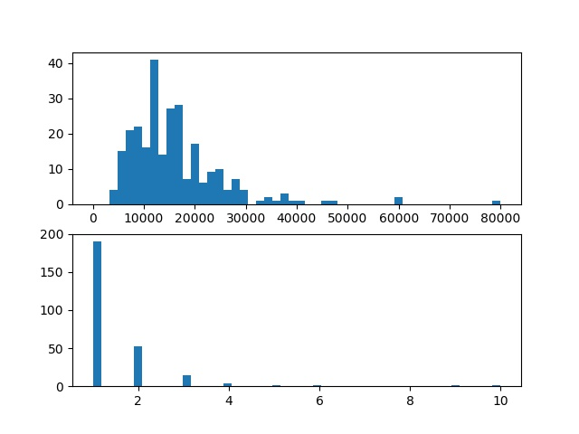
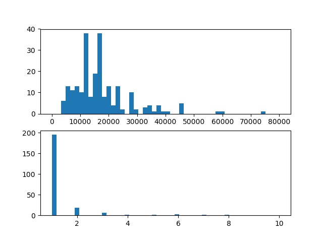
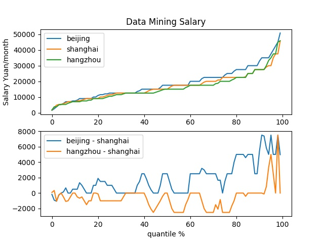

### 北京
#### group by company
平均工资和工作岗位最多的前10个company分别为：
|company|salary|company|count|
|----|----|----|----|
|北京慧据科技产业发展有限公司|65000.0|今日头条|27|
|广州尚宸企业管理顾问有限公司|60000.0|北京搜狗科技发展有限公司|26|
|青岛学盟网络科技有限公司|54166.6666667|百度在线网络技术（北京）有限公司|21|
|唯品会（中国）有限公司|52500.0|美团点评|21|
|嘉兴安越企业管理咨询有限公司|47500.0|宜信公司|11|
|长城证券股份有限公司|45833.3333333|优信集团|11|
|南京英诺森软件科技有限公司|45000.0|搜狐媒体|10|
|北京伯众联合管理咨询有限公司|45000.0|北京位来小猎科技有限公司|9|
|臻和（北京）科技有限公司|45000.0|网易集团|9|
|安投融（北京）金融信息服务有限公司|45000.0|小米通讯技术有限公司|9|
整体的分布密度图如下: 

#### group by job
平均工资和工作岗位最多的前10个job分别为：
|job|salary|job|count|
|----|----|----|----|
|商业数据分析科学家|75000.0|数据分析师|71|
|数据分析专家-传媒综合管理部020|60000.0|数据挖掘工程师|50|
|大数据平台架构师、技术总监|60000.0|大数据开发工程师|33|
|数据科学家(10001618)|60000.0|大数据工程师|15|
|数据科学家(10000408)|60000.0|大数据架构师|11|
|大数据开发总工程师|54166.6666667|数据分析工程师|10|
|大数据部-用户画像专家/资深专家-北京-02760|50000.0|大数据分析师|9|
|大数据平台架构师|50000.0|高级数据分析师|9|
|数据科学家(10005690)|45000.0|大数据产品经理|7|
|数据挖掘资深工程师、专家-电子商务部099|45000.0|数据分析专员|7|
整体的分布密度图如下: 

### 上海
#### group by company
平均工资和工作岗位最多的前10个company分别为：
|company|salary|company|count|
|----|----|----|----|
|华院数据技术（上海）有限公司|80000.0|美团点评|28|
|上海语味实业有限公司|80000.0|上海奥腾计算机科技有限公司|13|
|上海炫踪网络股份有限公司|65000.0|游族网络|12|
|上海铭垚信息科技有限公司|62500.0|五维引力（上海）数据服务有限公司|11|
|广州尚宸企业管理顾问有限公司|60000.0|上海帜讯信息技术股份有限公司|9|
|苏州达家迎信息技术有限公司|60000.0|善林（上海）金融信息服务有限公司|9|
|上海中城卫保安服务集团有限公司|60000.0|深圳平安综合金融服务有限公司（平...|8|
|成都市达峰企业管理有限公司|58333.3333333|上海你我贷互联网金融信息服务有限...|8|
|上海欣兆阳信息科技有限公司|56250.0|上海宏鹿信息技术服务有限公司|8|
|苏宁文创集团|54166.6666667|上海鱼耀金融信息服务有限公司|8|
整体的分布密度图如下: 

#### group by job
平均工资和工作岗位最多的前10个job分别为：
|job|salary|job|count|
|----|----|----|----|
|（高级）数据挖掘工程师|325000.0|数据分析师|120|
|数据开发专家|80000.0|数据挖掘工程师|59|
|大数据分析总监|60000.0|大数据开发工程师|53|
|大数据平台架构师、技术总监|60000.0|高级数据分析师|27|
|大数据算法分析主任工程师|58333.3333333|数据产品经理|20|
|大数据事业群 CTO|58333.3333333|数据分析经理|18|
|数据分析总监|54166.6666667|大数据架构师|16|
|大数据总监|48750.0|大数据分析师|16|
|快消公司 大数据高级经理|45833.3333333|数据分析工程师|15|
|主流金融机构 高级数据分析经理|45833.3333333|大数据工程师|14|
整体的分布密度图如下: 

### 杭州
#### group by company
平均工资和工作岗位最多的前10个company分别为：
|company|salary|company|count|
|----|----|----|----|
|杭州艺福堂茶业有限公司|80000.0|网易集团|16|
|杭州钱米网络科技有限公司|60000.0|杭州海康威视数字技术股份有限公司|10|
|广州尚宸企业管理顾问有限公司|60000.0|杭州西线教育科技有限公司|9|
|嘉兴安越企业管理咨询有限公司|47500.0|浙江核新同花顺网络信息股份有限公司|6|
|长城证券股份有限公司|45833.3333333|杭州数梦工场科技有限公司|5|
|华运智体产业运营管理（北京）有限...|40000.0|朗新科技股份有限公司|4|
|杭州偶尔科技有限公司|39583.3333333|杭州华量软件有限公司|4|
|杭州铜板街互联网金融信息服务有限...|37500.0|爱财科技有限公司|4|
|杭州远眺科技有限公司|37500.0|杭州览众数据科技有限公司|4|
|逸游信息科技（上海）有限公司|37500.0|浙大网新科技股份有限公司|3|
整体的分布密度图如下: 

#### group by job
平均工资和工作岗位最多的前10个job分别为：
|job|salary|job|count|
|----|----|----|----|
|金融大数据和人工智能专家|75000.0|数据分析师|59|
|大数据平台架构师、技术总监|60000.0|数据挖掘工程师|35|
|数据分析经理|58833.3333333|大数据开发工程师|14|
|数据与人工智能专家|45833.3333333|高级数据分析师|8|
|电商大数据专家-跨境电商013|45000.0|大数据分析师|7|
|资深产品经理（大数据）-杭州研究院883|45000.0|数据产品经理|6|
|大数据科学家|45000.0|数据库工程师|6|
|数据科学家|45000.0|数据分析|6|
|数据平台架构师|40000.0|大数据产品经理|5|
|数据挖掘及分析团队leader|39583.3333333|大数据架构师|4|
整体的分布密度图如下: 

### 北京、上海、杭州对比
三个城市不同分位数水平下的工资对比图如下：
